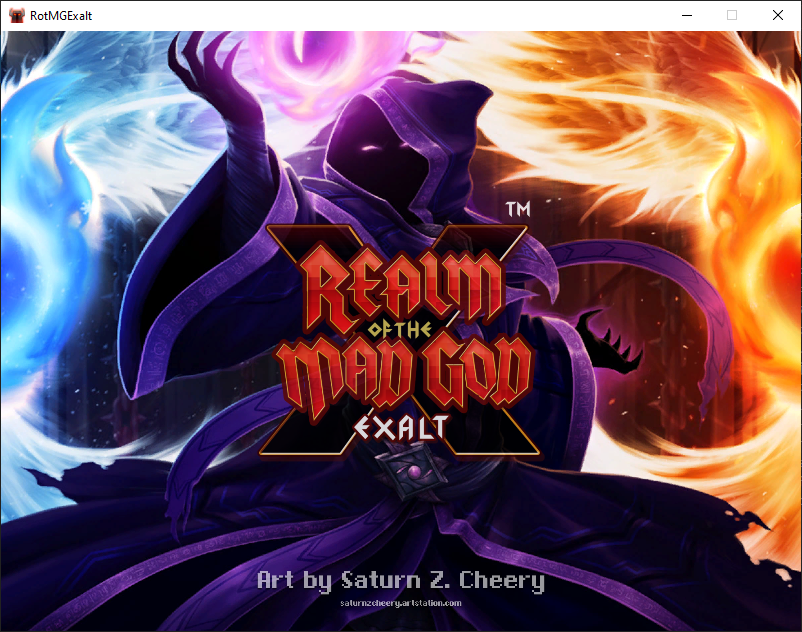

# RotMG One Click Login

### Automated login for Realm of the Mad God (RotMG) and launching multiple game instances (up to 2) in windowed mode with a resolution of 800x600. This script was initially designed for easy mule management and one-click login for seamless item transfers between accounts. 

## Features
- Unlimited Accounts: Supports unlimited accounts, reading them from a CSV file (accounts.csv). Each account includes an email, password, username, and a nickname for easier identification.
- Automatic Token Generation: Automatically generate secure device token and access token for authentication.
- Game Launch: Launch RotMG client with custom parameters. By default, the instance will launch in a windowed mode with a resolution of 800x600.
- Multiple Instance Support: Launch multiple game instances simultaneously (up to 2).

## Prerequisites
Before running the project, ensure you have the following installed:
- Python 3.x
- requests
- wmi

## Installation
1. Clone the repository
```bash
git clone https://github.com/christiancheng15/RotMG-One-Click-Login.git
cd RotMG-One-Click-Login
```

2. Install the necessary prerequisites
```bash
pip install -r requirements.txt
```

## Usage
1. Add Accounts to `accounts.csv`
- `email`: The account's email address.
- `password`: The account's password.
- `username`: The account's username.
- `nickname`: A nickname for easy identification.

2. Running the script
```bash
python main.py
```

## Output
Upon running the script, you will see a list of accounts similar to the example below:
```
Accounts:
1. [Deca Rings] Testing | testing@gmail.com
Select an account by index to start an instance (or enter 0 to exit):
```
Select an account to start an instance. By default, the instance will launch in a windowed mode with a resolution of 800x600. You can open a maximum of 2 instances at a time before DECA imposes an IP cooldown.



## Troubleshooting
- Login Errors: Ensure that the username and password are correct. Double-check for typos or incorrect credentials.
- Directory Issues: Ensure that the RotMG directory is correctly specified and accessible. Verify that the path to the game files is correct.

## Contributing
Contributions are welcome! If you have ideas for new features or improvements, feel free to submit a pull request or open an issue.

## License
This project is licensed under the MIT License. See the [LICENSE](LICENSE) file for more information.

## Contact
For any questions or inquires, please contact [christiancheng15](https://github.com/christiancheng15/).